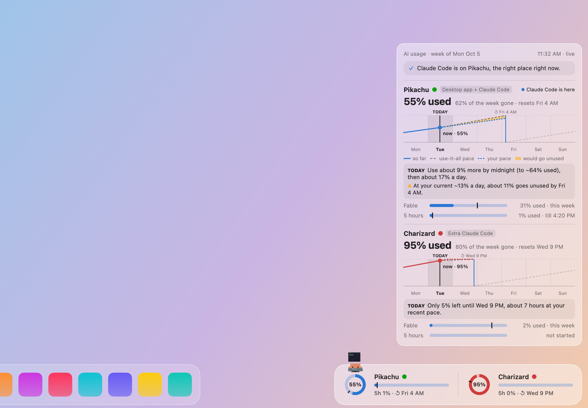
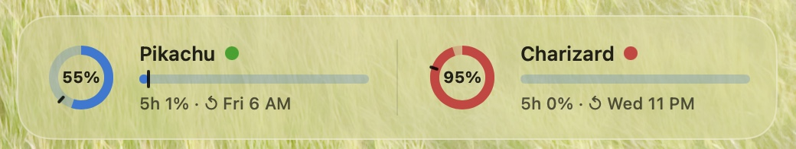
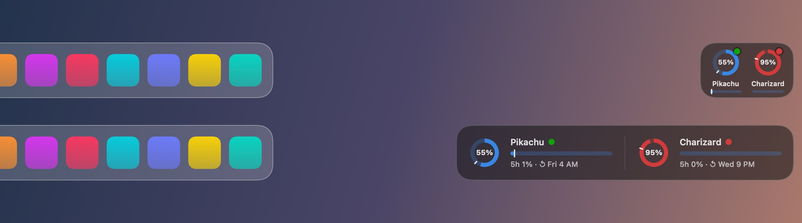
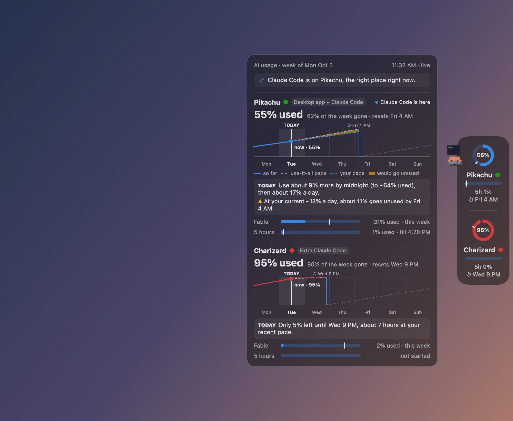
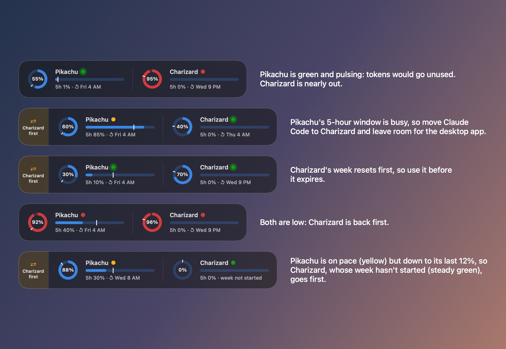
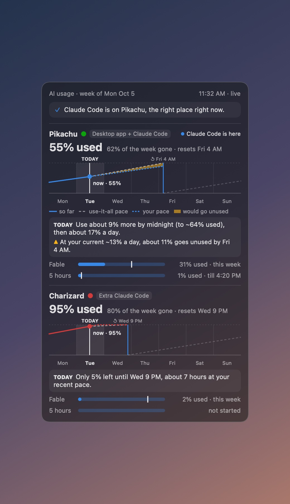
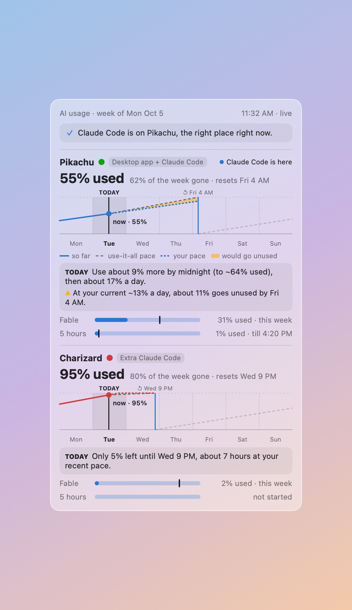

<h1 align="center">Claude Dock</h1>

<p align="center">
  <b>Your Claude plan usage, always in the corner of your screen.</b><br>
  A tiny Liquid Glass widget that sits beside the macOS Dock and shows, for every Claude
  organization you belong to, how much of this week and this 5-hour window you've used,
  and whether you should be using it right now.
</p>

<p align="center">
  
  
  
  
  
  <a href="LICENSE"></a>
</p>

<p align="center">
  <picture>
    <source media="(prefers-color-scheme: dark)" srcset="docs/images/hero-dark.jpg">
    
  </picture>
</p>

<p align="center"><sub>All screenshots use the built-in demo data: Pikachu and Charizard are two Claude organizations.</sub></p>

## Why

If you have more than one Claude plan (say a team plan shared with the Claude desktop app,
and another you switch Claude Code to when the first runs low), it's hard to tell how much
is left in each, when each one resets, and whether you're about to waste tokens that expire
at the end of the week. Claude Dock answers that at a glance, without opening a browser.

## Reading the widget

<p align="center">
  
</p>

| | What it shows |
|---|---|
| **Ring** | How much of this week's limit is used. The **tick** on the ring is how much of the week has gone by: keep the fill up near the tick and nothing goes unused. |
| **Bar** | How much of the current **5-hour window** is used. Its tick is how far into the window you are. |
| **Dot** | 🟢 **use it**: at your current pace tokens would go unused at reset · 🟡 **on pace** · 🔴 **nearly out** |
| **Caption** | `5h 19% · ↺ Fri 4 AM`: the 5-hour window's use, then when the week resets. |
| **Particles** | The org's usage went up at the last reading (desktop app and browser use, up to 3 minutes late). For Claude Code's own work they show only when **Show the crab** is off; the crab replaces them otherwise. |
| **⇄ tab** | Appears only when Claude Code should switch orgs, e.g. `Charizard first`. |

It's as tall as your Dock, its rings are the size of your Dock icons, and it uses the same
clear Liquid Glass, so it looks like part of the Dock. Point at an org for the whole
story in a sentence (VoiceOver reads the same).

**Compact or full.** The widget starts compact: each org's ring, name and 5-hour line.
Drag its inner edge (the side facing the screen's middle) to resize it; it snaps to
compact or full, and right-click → **Size** → **Compact** / **Full** does the same. Click it
for the panel at either size. Pointing at it changes nothing.

<p align="center">
  
</p>

With one org, there's nothing to switch between, so you just get the ring, bar and dot.

## Put it anywhere

Drag it near a corner or the middle of either side and it snaps into place; drop it anywhere
else and it stays put. On the left or right edge it becomes a narrow strip, like a Dock on
the side, and the panel opens beside it.

<p align="center">
  
</p>

Right-click it for **Position** (any corner or side), **Layout** (automatic, horizontal or
vertical), **Size** (Compact, Full, Small, Match Dock, Large, Extra large), **Show the crab**,
**Connect to Claude Code…** and **In-use effect** (Sparks, Flow, Shimmer or Off, and Subtle, Normal or
Lots), or pinch on your trackpad over it to resize freely.

## The crab

A small crab perches on the org Claude Code is signed into, mostly outside the glass: above
the widget, below it when the widget is at a top position, and beside it on a vertical
strip. It shows what Claude Code is doing:

- **Idle**: resting.
- **Thinking**: pondering.
- **Using a tool**: typing away while a command or edit runs.
- **Waiting for you**: a red **!** when Claude Code needs your permission.
- **Done**: celebrates for about 10 seconds, then goes back to idle.

It shows while a Claude Code session is open (or, unconnected, while Claude Code is
writing), and hides when the widget's data is stale. Right-click → **Show the crab** turns it on or off. **Connect to Claude Code…** adds hooks
to `~/.claude/settings.json` (after asking) so the crab sees each event within about a
second; **Disconnect from Claude Code** removes them. Without connecting, the crab still
types while Claude Code works and celebrates when it stops, but it can't tell thinking from
tools or show the **!**. Claude Code sessions started before you connect keep running
without the hooks until you restart them.

## Every state

<p align="center">
  
</p>

## The panel

Click the widget for the detail: your week on a Monday-to-Sunday chart with **today**
highlighted, the pace that would use everything by reset against the pace you're on, the
**amber wedge** that would go unused, what to do today, the model-specific weekly limit, and
the 5-hour window. Both orgs share one calendar, so their days line up even though their
weeks reset at different times.

<table>
  <tr>
    <td></td>
    <td></td>
  </tr>
</table>

## How it decides

**Stoplight** (first match wins):

| Dot | When |
|---|---|
| 🔴 | under 10% of the week left, or on track to run out 12+ hours before reset, or the 5-hour window is 95%+ used |
| 🟡 | the 5-hour window is 80%+ used, or less than 5% would go unused, or running out slightly early |
| 🟢 | 5% or more would go unused |

**Switching orgs:** an org can take Claude Code when it has at least 10% of its week left and
its 5-hour window is under 80% used (the org shared with the desktop app also keeps a 15%
buffer). Of those, the one whose week resets soonest wins (use it before it expires). Advice
has to hold for two readings before it shows, and won't flip back within an hour unless the
org you're on turns red. Every threshold is adjustable in Settings.

"Your pace" is your usage over the last 3 days, so one heavy afternoon or a quiet weekend
doesn't swing the forecast.

## Install

**You need** macOS 14 or later and a Swift 6 toolchain: Xcode 16 or later, or just its
Command Line Tools (`xcode-select --install`). The clear Liquid Glass look needs macOS 26
and the tools that come with it (Xcode 26 or Command Line Tools 26); with older tools, or on
an older macOS, it builds and runs with a frosted card instead.

```sh
git clone https://github.com/wbuf81/claudedock.git
cd claudedock
./build.sh                                        # 1–2 minutes the first time; Apple Silicon + Intel
rm -rf "/Applications/Claude Dock.app"            # an older copy, when updating (quit it first)
cp -R "build/Claude Dock.app" /Applications/
open "/Applications/Claude Dock.app"
```

**The first time it opens:**

1. A window asks you to sign in to claude.ai, once. Google and single sign-on work in it.
   If you sign in by email, claude.ai emails a link that would open in your browser: copy
   the link instead, then click **Open copied sign-in link**.
2. The widget appears at the bottom right, beside the Dock, or just above it when the Dock
   reaches that corner.
3. Run from Applications, it adds itself to your login items (turn that off in Settings).
4. macOS asks about notifications the first time there's something to tell you.

Then:

- **Click** the widget to open the panel; click anywhere else or press Esc to close it.
- **Drag** it anywhere; near a corner or the middle of a side it snaps there, and it remembers the spot.
- **Pinch** on your trackpad over it to resize it.
- **Right-click** for Refresh now, Position, Layout, Size, Hide for 1 hour, Settings, Sign out and Quit.
- **Settings** picks which orgs to show and which one the desktop app shares, sets every
  threshold, toggles notifications, and has a **demo mode** with Pokémon sample data.

It sends a notification when Claude Code should switch orgs, when the org it's on turns
red, and if claude.ai signs it out.

### Things to know

- **It lives on your main display**, the one with the menu bar.
- **The Dock's width is estimated** from what's in it (macOS doesn't say). Minimized windows
  can't be counted, so with several of them the widget may overlap the Dock's end: drag it
  away, or right-click → **Position**.
- **With the Dock hidden or on a side**, the bottom-right corner floats over your windows,
  as the widget always stays on top. Move it wherever suits you.
- **When something goes wrong** (offline, signed out, claude.ai changed), the widget greys
  out and says what happened rather than guessing; the panel has the details.
- **English only**, though times follow your region's 12- or 24-hour clock.

## Privacy

- Claude Dock signs in to claude.ai in **its own private web view**, separate from your
  browsers and the Claude desktop app. **Sign out** in the menu deletes everything in that
  web view, including any Google or single sign-on cookies from signing in.
- It only **reads**: GET requests to claude.ai's usage endpoints every 3 minutes. It never
  sends chats, changes settings or touches billing.
- It reads **one field** from `~/.claude.json`: which org Claude Code is signed into.
- Connecting adds hooks to `~/.claude/settings.json` that write only what Claude Code is doing (a word like thinking or done) and the time
  to a file per session in `~/Library/Application Support/ClaudeDock/sessions`. Claude Dock
  never reads your prompts or transcripts. Disconnect removes them, and puts the file back
  exactly as it was if nothing else changed it; if something else did, it removes only Claude
  Dock's entries. Claude Dock keeps copies of the file in its support folder: from before
  Connect (`settings-before-connect.json`) and as Connect wrote it (`settings-after-connect.json`).
- It watches `~/.claude/projects` for changes, to know when Claude Code is working. It
  never opens those files.
- History stays on your Mac in `~/Library/Application Support/ClaudeDock/`, kept 35 days.
- No analytics, no other servers.

claude.ai's usage endpoints are not a public API and may change; if they do, the widget
greys out and shows when it last updated rather than guessing.

## Uninstall

If you connected to Claude Code, right-click → **Disconnect from Claude Code** first.
Then quit Claude Dock (right-click → **Quit**), turn it off in System Settings → General →
Login Items, then delete the app and what it keeps (your claude.ai session lives in the
WebKit folder, so this signs it out for good):

```sh
rm -rf "/Applications/Claude Dock.app" \
  ~/Library/Application\ Support/ClaudeDock \
  ~/Library/WebKit/com.wbuf81.claudedock \
  ~/Library/HTTPStorages/com.wbuf81.claudedock* \
  ~/Library/Caches/com.wbuf81.claudedock
defaults delete com.wbuf81.claudedock
```

## Developing

```sh
./test.sh                                                   # unit tests (Swift Testing)
"build/Claude Dock.app/Contents/MacOS/ClaudeDock" --render DIR    # every demo state as PNGs
"build/Claude Dock.app/Contents/MacOS/ClaudeDock" --showcase DIR  # the README images
```

`ClaudeDockCore` holds all the logic (parsing, pace, stoplight, switch advice, placement,
chart geometry, the on-screen sentences) as pure, tested Swift; `ClaudeDock` is the AppKit +
SwiftUI app around it. Running `./build.sh` while a copy from `build/` is open quits it and
reopens the new one. Before sharing a change, work through the
[manual checks](docs/manual-checks.md) the tests can't cover. The design spec and implementation plan live in
[`docs/superpowers/`](docs/superpowers/). `test.sh` exists because, with only the Command
Line Tools installed, SwiftPM can't find the Swift Testing macro plugin on its own.

## Contributing safely

This repository is public. Hooks in `.githooks/` block commits and pushes that contain
secrets, real account or organization IDs, email addresses, home-folder paths, or any
word on your private list. After cloning, turn them on:

```sh
git config core.hooksPath .githooks
```

Put your own private words (employer, organization names, real IDs), one per line, in
`.git/info/sensitive-patterns`. That file lives inside `.git/`, so it is never committed.
Images and PDFs can't be scanned, so they are blocked until you have looked at them
and run the commit and the push with `CLAUDEDOCK_ALLOW_MEDIA=1`.
Install [gitleaks](https://github.com/gitleaks/gitleaks) for an extra secret scan; the
hooks use it when present. To audit everything already tracked:

```sh
.githooks/scan-sensitive.sh --all
```

Examples in this repository use Pokémon names for organizations, never real ones.

## License

[MIT](LICENSE)

---

<sub>Claude Dock is an independent project, not affiliated with or endorsed by Anthropic.
Claude is a trademark of Anthropic, PBC.</sub>
